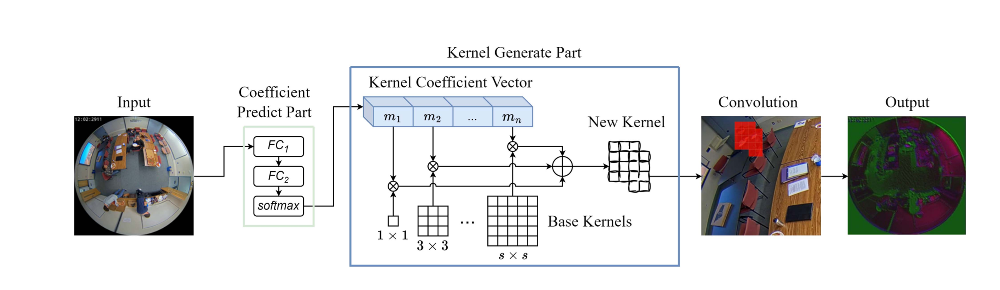
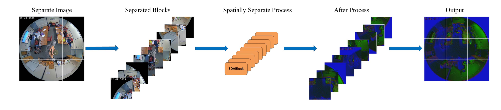
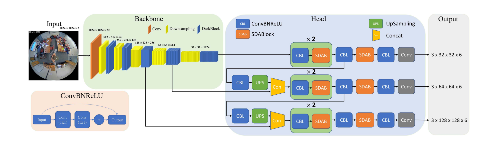
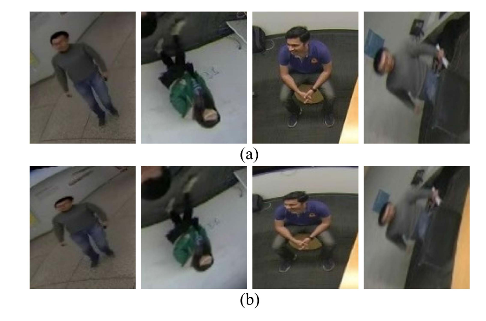
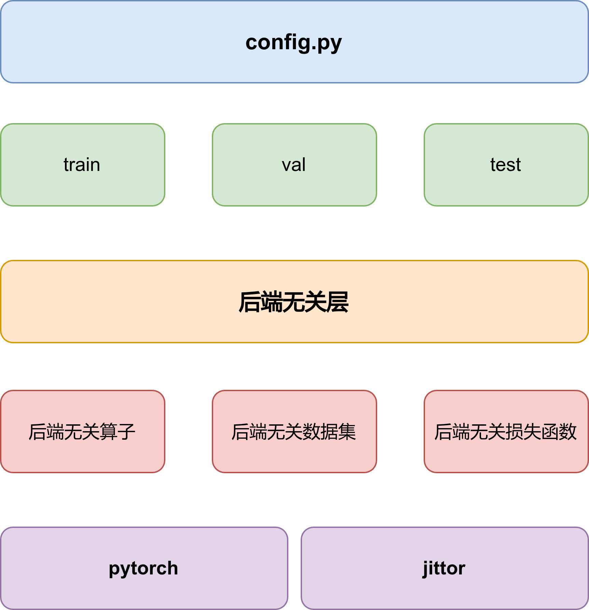
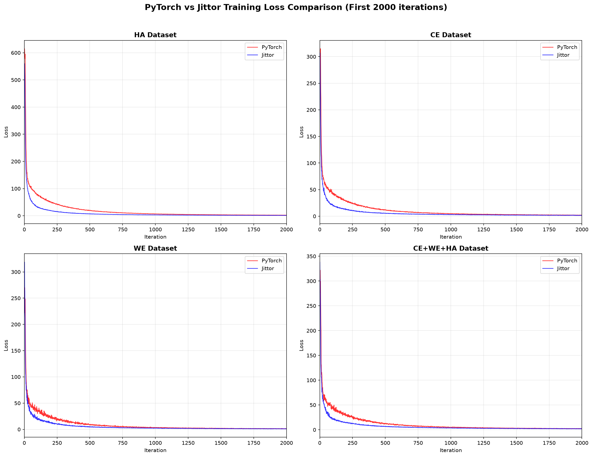

# SDANet (Jittor/PyTorch)

**Spatial Distortion-Aware Network** — 畸变感知适应网络

IEEE TMM 2026 论文 _"Towards Better Distortion Feature Learning for Object Detection in Top-View Fisheye Cameras"_ 复现，支持 **PyTorch** 与 **Jittor** 双后端。

## 论文摘要

SDANet 提出了一种动态卷积 + 空间分离策略的畸变感知适应网络，利用鱼眼镜头的畸变特性来提升目标检测性能。针对顶视鱼眼相机的畸变特性，SDANet 设计了 SDAConv 模块，该模块能够自适应地学习不同空间位置的卷积核组合，从而有效地捕捉畸变图像中的特征信息。通过在 FPN 颈部引入 SDAConv 横向连接，SDANet 能够在多尺度上进行有向框检测，显著提升了在畸变图像上的检测性能。此外，作者还提出一种在线畸变增强方法 PFDAug，用于在训练过程中模拟鱼眼的严重畸变，从而进一步提高模型的泛化能力。实验结果表明，SDANet 在多个鱼眼数据集上均取得了优异的性能，验证了其在顶视鱼眼相机目标检测任务中的有效性。





## 网络结构

网络基于YOLOv3改进


## 数据增强

作者提出了PFDaug数据增强方法，弥补了无严重畸变的数据集在训练时的不足，模拟了鱼眼镜头的严重畸变，提升了模型的泛化能力。



## 项目架构



## 训练对齐

jittor 模型均在 WSL2 2080Ti上训练，pytorch均在  modelscope的A10 上训练




## 实验结果

### 单模型测试结果

#### Val Set

| 模型 | 数据集 | Backend | mAP | AP@50 | AP@75 | F-score | FPS |
|------|--------|---------|-----|-------|-------|---------|-----|
| HA | habbof | PyTorch | 59.00% | 97.72% | 66.90% | 98.00% | 21.3 |
| HA | habbof | Jittor | 58.51% | 96.73% | 64.29% | 97.26% | 17.4 |
| CE | cepdof | PyTorch | 47.42% | 95.23% | 39.17% | 95.40% | 29.4 |
| CE | cepdof | Jittor | 46.66% | 94.53% | 37.16% | 94.26% | 18.7 |
| WE | wepdtof | PyTorch | 42.68% | 86.54% | 36.22% | 89.74% | 25.7 |
| WE | wepdtof | Jittor | 40.98% | 85.83% | 33.08% | 88.86% | 17.4 |

#### Test Set

| 模型 | 数据集 | Backend | mAP | AP@50 | AP@75 | F-score | FPS |
|------|--------|---------|-----|-------|-------|---------|-----|
| HA | habbof | PyTorch | 58.87% | 97.79% | 64.97% | 98.16% | 21.3 |
| HA | habbof | Jittor | 59.89% | 97.33% | 66.42% | 97.54% | 17.6 |
| CE | cepdof | PyTorch | 47.38% | 95.15% | 38.49% | 95.34% | 29.5 |
| CE | cepdof | Jittor | 46.81% | 94.93% | 36.84% | 94.44% | 19.1 |
| WE | wepdtof | PyTorch | 42.87% | 86.87% | 36.54% | 89.46% | 25.5 |
| WE | wepdtof | Jittor | 41.35% | 86.05% | 34.38% | 88.97% | 17.5 |

#### Val + Test Set

| 模型 | 数据集 | Backend | mAP | AP@50 | AP@75 | F-score | FPS |
|------|--------|---------|-----|-------|-------|---------|-----|
| HA | habbof | PyTorch | 58.91% | 97.73% | 66.15% | 98.05% | 25.4 |
| HA | habbof | Jittor | 58.86% | 96.84% | 64.82% | 97.35% | 17.6 |
| CE | cepdof | PyTorch | 47.40% | 95.20% | 38.93% | 95.38% | 29.9 |
| CE | cepdof | Jittor | 46.69% | 94.65% | 37.02% | 94.32% | 19.1 |
| WE | wepdtof | PyTorch | 42.73% | 86.64% | 36.30% | 89.65% | 26.2 |
| WE | wepdtof | Jittor | 41.09% | 85.89% | 33.50% | 88.89% | 17.9 |

### 联合模型测试结果 (CE+WE+HA)

| 目标数据集 | Backend | mAP | AP@50 | AP@75 | F-score | FPS |
|------------|---------|-----|-------|-------|---------|-----|
| CEPDOF | PyTorch | 42.47% | 93.22% | 27.64% | 94.19% | 29.2 |
| CEPDOF | Jittor | 38.11% | 90.49% | 20.60% | 91.02% | 19.6 |
| WEPDTOF | PyTorch | 29.55% | 75.86% | 13.93% | 81.15% | 24.8 |
| WEPDTOF | Jittor | 28.09% | 73.09% | 12.92% | 77.09% | 17.1 |
| HABBOF | PyTorch | 42.24% | 92.36% | 30.17% | 93.00% | 25.7 |
| HABBOF | Jittor | 42.99% | 92.39% | 33.49% | 92.96% | 18.7 |

## 模型获取

所有模型权重现已开源在modelscope https://www.modelscope.cn/models/chuanshanjia666/SDA-Net/files

## 快速开始

### 1. 环境准备

pytorch后端使用任意安装方式即可，可以使用系统包管理器，pip，conda等方式安装。
可以使用提供的conda环境文件创建环境：

```bash
conda env create -f env/environment-torch.yml
conda activate sdanet-pytorch
pip install torch torchvision --index-url https://download.pytorch.org/whl/cu126
```

jittor的兼容性一般，推荐使用docker镜像，来保证最佳兼容性，jittor官方镜像最后一次更新在五年前，所以我们提供了一个基于Nvidia镜像的自定义镜像，包含了jittor和其他依赖。

```bash
docker build -t sdanet-jittor-cu126 -f docker/Dockerfile.cu126 .
```

### 2. 下载预训练骨干网络

```bash
python pretrain/download_pretrained.py
python pretrain/convert_to_jittor.py          # jittor可以直接使用pytorch权重，非必须
```

### 3. 准备数据集

使用HABBOF CEPDOF WEPDTOF 数据集，你可以从这里下载 https://vip.bu.edu/projects/vsns/cossy/datasets

```bash
# HABBOF: .txt → COCO JSON
python tools/convert_habbof.py --root datasets/HABBOF
# 拆分 train/val/test
python tools/split_train_val.py --ann datasets/HABBOF/annotations/all.json
# CEPDOF / WEPDTOF: 合并多场景 JSON
python tools/merge_cepdof.py
python tools/merge_wepdtof.py
```

### 4. 训练

所有超参数均在 `config.py` 中配置，开源在modelscope的模型的配置文件：

```python
BACKEND = "jittor"
DEVICE = "cuda"
NUM_WORKERS = 4
TRAIN_DATASETS = ["wepdtof[train]"]
VAL_DATASETS   = ["wepdtof[val]"]
TEST_DATASETS  = ["wepdtof[test]"]
IMAGENET_MEAN = [0.485, 0.456, 0.406]
IMAGENET_STD  = [0.229, 0.224, 0.225]
PFDAUG_ENABLED = True
PFDAUG_K = (0.1,0.2,0.3,0.35,0.4,0.45,0.48,0.49,0.5)
PFDAUG_P = 0.2
BATCH_SIZE = 64
INPUT_SIZE = 416
USE_ACCUMULATION_STEP = True
STEP_BATCH_SIZE = 4 if USE_ACCUMULATION_STEP else BATCH_SIZE
GN_NUM_GROUPS = 32
USE_FP16 = True
LOAD_FROM_PRETRAIN = True
LR = 0.0001
MOMENTUM = 0.9
WEIGHT_DECAY = 0.0001
MAX_ITER = 6000
WARMUP_ITERS = 20
VALIDATE_INTERVAL = 20
SAVE_INTERVAL = 50
LOG_INTERVAL = 1
RESUME = None
AUTO_RESUME = True
OUTPUT_DIR = "output"
USE_COSINE_SCHEDULER = True
MIN_LR = 1e-6
# 可以直接使用pytorch权重
DARKNET53_PRETRAINED = "pretrain/darknet53_backbone.pth"
FPN_CHANNELS = [256, 512, 1024]
NECK_OUT_CHANNELS = 128
SDA_BASE_KERNELS = (1, 3, 5)
SDA_FC_RATIO = 128
SSS_GRID = 3
SSS_ENABLED = True
NUM_ANCHORS = 3
BOX_FIELDS = 6
ANCHORS_AUTO_CLUSTER = True  # if True, load from cache; else use ANCHORS below
ANCHORS = [
    [(10, 13), (16, 30), (33, 23)],
    [(30, 61), (62, 45), (59, 119)],
    [(116, 90), (156, 198), (373, 326)],
]
STRIDES = [8, 16, 32]
BOX_LOSS_WEIGHT = 1.0
CLS_LOSS_WEIGHT = 1.0
OBJ_LOSS_WEIGHT = 1.0
IOU_THRESH = 0.5
CONF_THRESH = 0.3
NMS_IOU_THRESH = 0.45
MAX_DETECTIONS = 300
RANDOM_SEED = 42
```

```bash
python tools/train.py
```

config.py 中有详细的注释说明每一个参数

### 5. 测试与评估

```bash
python tools/test.py
```

自动加载 `output/` 目录下最新的权重，在全测试集上推理并输出：

- **COCO 风格指标**：AP@50 / AP@75 / mAP@[.50:.95] / AP_small / AP_medium / AP_large
- **VOC 风格指标**：AP@IoU=0.50, 每类 AP, mAP
- **可视化结果**：保存到 `output/vis_results/`（前 NUM_VIS 张）

## 支持的数据集

| 数据集      | 类别   | 场景          | 说明                 |
| ----------- | ------ | ------------- | -------------------- |
| **HABBOF**  | person | 实验室/会议室 | 室内顶视鱼眼，仅人物 |
| **CEPDOF**  | person | 多活动场景    | 各类室内活动，仅人物 |
| **WEPDTOF** | person | 商店/办公室   | 多场景监控，仅人物   |

所有数据集统一转换为带旋转框 `bbox: [cx, cy, w, h, R]` 的 COCO 格式。

## 📝 引用

```bibtex
@article{sdanet2026,
  title={Towards Better Distortion Feature Learning for Object Detection in Top-View Fisheye Cameras},
  journal={IEEE Transactions on Multimedia (TMM)},
  year={2026}
}
```

## 📄 License

见 [LICENSE](LICENSE)。
